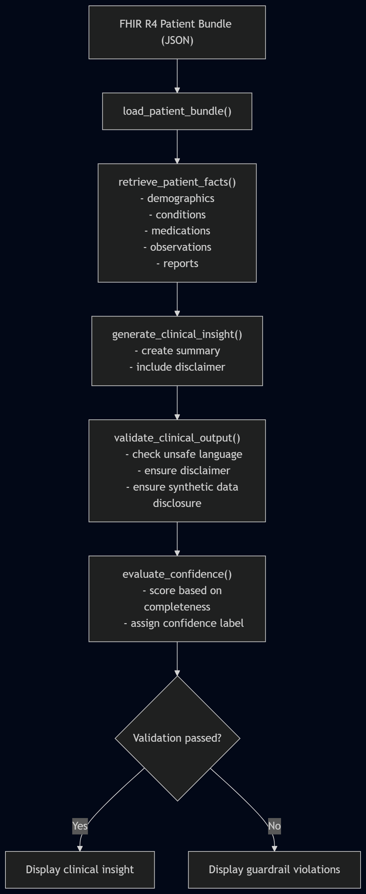
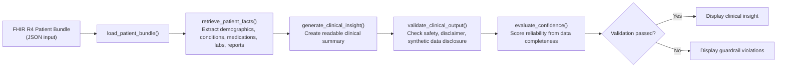

# Clinical Insight Pipeline: Applied AI System for FHIR Patient Data

A modular Python pipeline that processes a synthetic FHIR R4 patient bundle to extract structured clinical facts, generate a human-readable clinical insight summary, validate it using safety guardrails, and assign a confidence score based on data completeness.

Built as a final project to demonstrate responsible AI system design patterns applied to healthcare data.

## Demo Walkthrough

Watch the system run end-to-end, including multiple patient scenarios and evaluation behavior:

[Loom Video](https://www.loom.com/share/4abb69106d964b3b8c683d527557bf6b)

## Project Structure

```text
clinical-insight-engine/
├── data/
│   └── sample_patient.json   # Synthetic FHIR-style patient bundle
├── src/
│   ├── retriever.py          # Extracts structured clinical facts from FHIR JSON
│   ├── analyzer.py           # Generates a clinical insight summary
│   ├── guardrails.py         # Validates output for safety before display
│   ├── evaluator.py          # Scores confidence based on data availability and output quality
│   └── main.py               # Runs the full end-to-end pipeline
├── tests/
├── assets/
├── README.md
├── model_card.md
└── requirements.txt
```
Each module has a single responsibility, making the pipeline easy to understand, test, and extend.

## Pipeline Architecture

### End-to-End Clinical Insight Pipeline



### System Architecture (Diagram)

### Diagram


### Step-by-Step Flow

```text
load_patient_bundle()
    ↓
retrieve_patient_facts()
    ↓
generate_clinical_insight()
    ↓
validate_clinical_output()   ← checks safety and compliance
    ↓
evaluate_confidence()        ← scores reliability based on data completeness
    ↓
(validation passed?)
  yes → display clinical insight
  no  → display guardrail violations
```

## Example Output

```text
========================================
=== Retrieved Patient Facts ===

{'conditions': [{'clinical_status': 'active',
                 'condition': 'Type 2 Diabetes Mellitus',
                 'onset': '2018-06-01'},
                {'clinical_status': 'active',
                 'condition': 'Chronic Kidney Disease Stage 2',
                 'onset': '2021-11-10'}],
 'medications': [{'medication': 'Metformin 500mg'},
                 {'medication': 'Empagliflozin 10mg'}],
 'observations': [{'observation': 'HbA1c', 'value': 7.8, 'interpretation': 'High'},
                  {'observation': 'eGFR (CKD-EPI)', 'value': 68, 'interpretation': 'Low'}]}

========================================
=== Guardrail Check ===

{'passed': True, 'issues': []}

========================================
=== Evaluation ===

{'confidence_score': 1.0, 'confidence_label': 'High confidence'}

========================================
=== Clinical Insight Summary ===

- Patient Context: Elena M Rivera is a synthetic patient with documented clinical history.
- Key Conditions: Type 2 Diabetes Mellitus, Chronic Kidney Disease Stage 2.
- Current Medications: Metformin 500mg, Empagliflozin 10mg.
- Lab Finding: HbA1c is 7.8%, flagged as High.
- Lab Finding: eGFR (CKD-EPI) is 68 mL/min/1.73m2, flagged as Low.
```

## AI Design Features

- **Retrieval-based architecture:** The system extracts structured facts from FHIR JSON before generating an insight summary.
- **Transparent reasoning layer:** The analyzer uses retrieved facts to create a readable clinical summary.
- **Guardrail enforcement:** The system validates output for safety and only displays the insight if validation passes.
- **Confidence scoring:** The evaluator assigns a reliability score based on data availability and output quality.
- **Responsible healthcare framing:** The output clearly states that the data is synthetic and not medical advice.

## Sample Patient

The synthetic patient represents a realistic clinical scenario:

- **Type 2 Diabetes Mellitus (T2DM)** with suboptimal glycemic control (HbA1c 7.8%)
- **Chronic Kidney Disease (CKD) Stage 2**, reflected by eGFR of 68 mL/min/1.73m2
- Treated with **Metformin** and **Empagliflozin**, an SGLT2 inhibitor with both glucose-lowering and renal-protective effects

The dataset is designed to reflect clinically meaningful relationships between conditions, labs, and medications.

All data is **synthetic** and does not represent real patients.

## How to Run

This project uses only Python’s standard library.

```bash
python src/main.py
```

## Expected output includes:

- Retrieved patient facts  
- Guardrail validation results  
- Confidence evaluation  
- Clinical insight summary (if validation passes)

## Data Sources

- FHIR R4 Specification: https://hl7.org/fhir/R4  
- LOINC (lab codes): https://loinc.org  
- SNOMED CT (conditions): https://www.snomed.org  
- RxNorm (medications): https://www.nlm.nih.gov/research/umls/rxnorm  
- US Core Implementation Guide: https://hl7.org/fhir/us/core

## Limitations

- Confidence scoring is based on data presence, not clinical severity or correctness  
- Guardrails use rule-based phrase detection and may not capture subtle unsafe language  
- The system processes a single patient bundle and does not support batch workflows  
- Insight generation is deterministic and does not use machine learning

## Design Decisions

- A rule-based approach was chosen over machine learning to prioritize transparency and interpretability
- Guardrails were separated from the analyzer to enforce safety independently of generation logic
- Confidence scoring was implemented to provide a simple, explainable measure of system reliability
- The system was designed as a modular pipeline to support extensibility and easier debugging

## Testing Summary

- Retrieval successfully extracted expected patient fields during manual testing
- Guardrails correctly allowed safe outputs and flagged unsafe phrasing patterns
- Confidence scores aligned with data completeness across scenarios
- The system executed without runtime errors across tested runs

## Reflection

This project reinforced the importance of designing AI systems that are not only functional but also safe and interpretable, especially in healthcare contexts where outputs could be misread as clinical guidance. Separating retrieval, reasoning, validation, and evaluation made the system easier to debug and reason about.

One limitation of the system is that it relies on rule-based logic rather than learned models, which means it does not capture deeper clinical nuance or context. Additionally, the confidence score is based on data presence rather than clinical significance, so it may not fully reflect the quality or importance of the underlying data.

This system could be misused if its outputs were interpreted as real clinical recommendations. To mitigate this, I implemented guardrails that enforce a safety disclaimer, ensure the data is clearly identified as synthetic, and block unsafe or advisory language from being displayed.

One key insight was that even simple rule-based systems benefit significantly from guardrails and evaluation layers to improve trustworthiness. One unexpected finding during testing was that the confidence score consistently dropped when key data components, such as medications or observations, were removed. This confirmed that the evaluator behaved as intended across multiple patient scenarios.

AI assistance was helpful in structuring the system and suggesting modular design patterns, particularly in organizing the pipeline into distinct components. However, some suggestions required validation and correction, especially around edge-case handling and ensuring safe data access in FHIR parsing. This reinforced the importance of critically evaluating AI-generated suggestions rather than relying on them directly.

Overall, this project reflects my approach to AI engineering, building systems that are modular, interpretable, testable, and designed with safety considerations in mind.

## Safety Note

This project is for educational purposes only.

- All patient data is synthetic  
- No output constitutes medical advice  
- The system includes guardrails to prevent unsafe or misleading outputs

## Responsible AI Documentation

This project follows responsible AI practices, including transparency, safety validation, and clear limitations.

See [model_card.md](model_card.md) for intended use, limitations, and ethical considerations.

## Stretch Features

While not required, this project incorporates elements of a reliability and evaluation system through multiple patient test scenarios and confidence scoring.

- Multiple predefined patient inputs (full data, missing observations, missing medications) were used to test system behavior.
- The evaluator produces a confidence score (0.0–1.0) that changes based on data completeness.
- Outputs were manually reviewed to confirm that the system adapts consistently across scenarios.

This aligns with the "Test Harness or Evaluation Script" stretch category.
